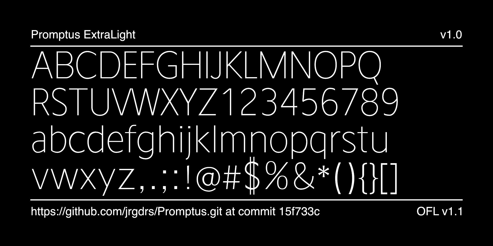
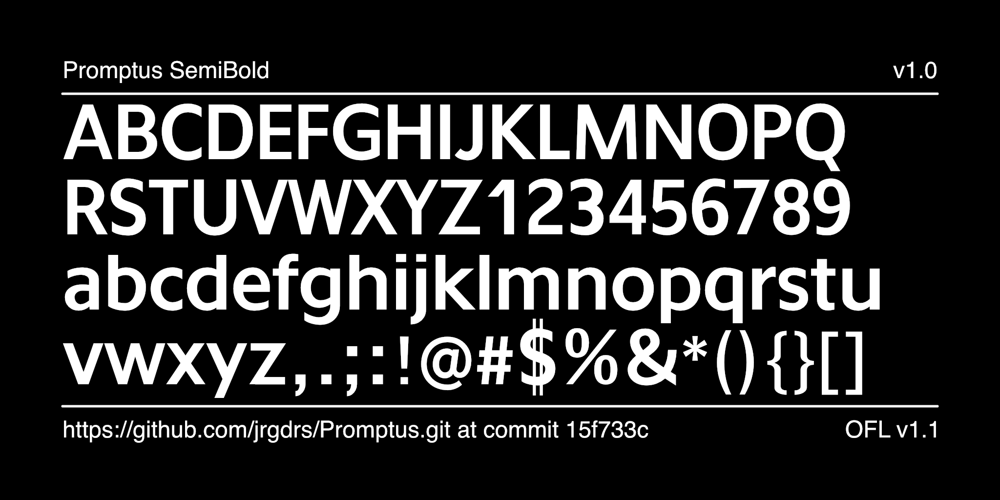
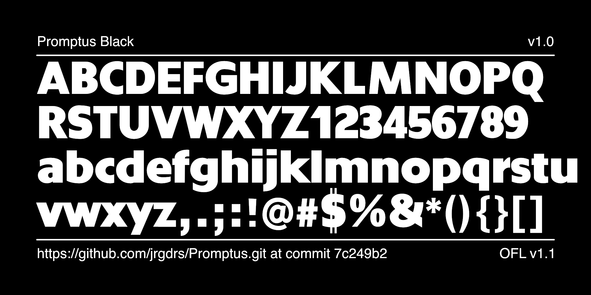

# Promptus Font Project

Tries to use something like Rogers AntiqueOlive in a Digital Interface UI scenario.

The font is under development.

Find specimen and language samples as pdf file in subfolder documentation.

## License

This Font Software is licensed under the SIL Open Font License, Version 1.1.
This license is available with a FAQ at
https://scripts.sil.org/OFL

## Repository Layout

This font repository structure is inspired by [Unified Font Repository v0.3](https://github.com/unified-font-repository/Unified-Font-Repository), modified for the Google Fonts workflow.
